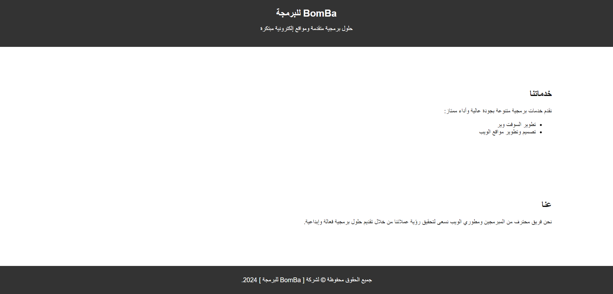

<h1 align="center">CV, Resume and Companies Portfolio</h1>


<p align="center">
  <a href="#">
    
  </a>
</p>

<!--  -->

<h4 align="center">Best-in-Class modern CV, Resume and Companies Portfolio website template</h4>
<h5 align="center"><strong>All-in-One-Page</strong> site with fully customizable builder</h5>

<p align="center">
  <code>cv</code>
  <code>resume</code>
  <code>portfolio</code>
  <code>template</code>
  <code>portfolio-website</code>
  <code>cv-template</code>
  <code>IT</code>
  <code>resume-template</code>
  <code>resume-website</code>
</p>

<hr />

<!-- # Frontend Projects 🌐              مشاريع الواجهة الامامية -->
<!-- ## Development                      التطوير -->
<!-- ## Projects 📂                      المشاريع -->
  <!-- https://github.com/Armanidrisi/frontend-projects?tab=readme-ov-file -->
  
## Installation 🚀                  <!-- التسبيت -->

<!-- You should have installed at least node version v18.18.2.|Nuxt.js v0 -->

#### 001 Clone the repository into your projects directory:
```
git clone https://github.com/BomBa-001/CV-BomBa.git
```

#### 002 go to folder Application:
```
cd CV-BomBa-dir
```

#### 003 Open in code editor & Open with Live Server:
```
code .
```

<!-- 
#### 004 Install the dependencies within the project directory:
```
npm install
```

#### 005 Run the Server|App:
```
npm dev --o
```

#### 006 Start the development server on:
#### ## * Edite this PORT in file .env the PORT Default :9000
```
http://localhost:9000
``` -->

## Description 📝
<pre style="
  font-size:70%;
  font-weight:700;
  color: #fff;
  background-color: #393;
  padding: 8px;
  border-radius: 8px;
  box-shadow: inset 0px 0px 4px #fff;
  overflow: auto;
" dir="rtl">مرحبًا بك في شركة [ BomBa ] - للبرمجة المتميزة
--- --- --- --- --- --- --- --- --- --- --- --- --- --- --- --- --- --- --- ---
- تقدم الشركة حلول برمجية متقدمة ومواقع إلكترونية مبتكرة,حيث يلتقي الإبداع بالتكنولوجيا لنخلق الحلول المستقبلية.
- نحن لسنا مجرد شركة برمجة، بل نمثل محورًا للابتكار والتفوق في عالم البرمجة.
**في شركتنا:
  - نجسد رؤية مستقبلية حيث تكون التقنية عاملًا رئيسيًا في تحسين الحياة اليومية.
  - نقدم خدمات برمجة متنوعة تشمل [ تطوير البرمجيات، وبناء تطبيقات الويب الديناميكية، وتصميم حلاقل مخصصة لتلبية ] احتياجات عملائنا بكفاءة وإبداع.
  - فريقنا مكون من خبراء محترفين في مجالات متعددة من البرمجة، ونعتبر الإبداع والأداء العالي جزءًا لا يتجزأ من هويتنا.
  - نحن نسعى جاهدين لتحقيق أهداف عملائنا بأحدث التقنيات والأساليب البرمجية.
  --- --- ---
  - لا نقدم مجرد حلول، بل نبني شراكات مستدامة مع عملائنا، حيث نفهم تمامًا احتياجاتهم ونعمل بجد لتحقيق رؤيتهم. نفخر بتقديم خدماتنا بروح الابتكار والجودة، حيث يعكس كل كود نكتبه روح الاهتمام بالتفاصيل والتفرد.
  - اختر شركة البرمجة المتميزة لتكون رفيقك في رحلة التحول الرقمي، حيث يلتقي الإلهام بالتقنية لنصنع معًا مستقبلًا رقميًا مبهرًا وفريدًا.

</pre>

<!-- ## Author                            الإستخدام -->
<!-- [Hussein Abdo](https://bomba-001.github.io/CV-Hussein/)
<a href="https://bomba-001.github.io/CV-Hussein/" target="_blank">Hussein Abdo</a>
 -->
 
<!-- ## Usage 💻                         الإستخدام -->
<!-- ## Contributing 🤝                  المساهمة -->
## License ©️                       <!-- الرخصة -->
The License ([BOMBA](https://bomba-001.github.io/BomBa/))

Copyright (c) 2016 [Hussein Abdo](https://bomba-001.github.io/CV-Hussein/)
